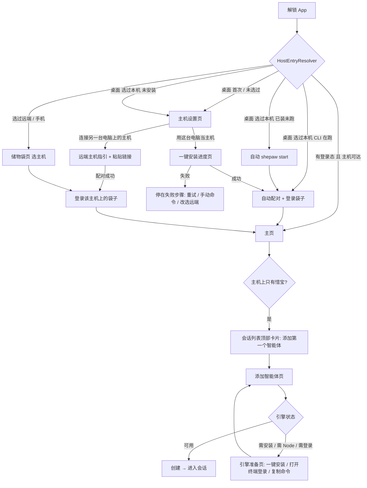

# 从解锁到第一个智能体：主机接入流程（决策记录）

- 日期：2026-10-05
- 状态：**待实现**
- 关联：`docs/pouch_host_refactor_decision.md`（主机 / 客户端 / 袋子的角色划分，本文不改动那份裁定）
- 涉及仓库：`shepaw`（Flutter App）、`shepaw-cli`（Rust Hub）

本文写给编码 agent。第 1 节是现象和根因（都附了证据，改之前先复现）；第 2–5 节是要做成的样子；第 6–7 节按文件列出改动；第 8 节是分 PR 顺序和验收。

---

## 1. 现状和根因

用户报告：桌面 App 解锁后，会话列表里一开始就有惜宝，带着主机名徽标（这台电脑的名字）；用 `shepaw pair` 的链接配对成功后，通讯录仍显示「尚未配对任何设备」。整条链路割裂。

### 1.1 通讯录为什么是空的

不是一个 bug，是四个叠在一起：

| # | 根因 | 证据 |
|---|---|---|
| A | **恢复登录时不刷新本机主机的地址。** `login_screen._goHome` 走 `decidePouchEntry → resume` 直接进主页，不经过 `CliHost.ensurePaired`，所以主机那行的 `local_endpoint` 不会改回 `127.0.0.1`。手动粘贴配对时，`requestPairing` 按指纹把这行覆盖成二维码里的局域网地址 `ws://192.168.41.3:18794`。换网后，`PeerConnectionManager` 判断不在同网段，跳过局域网，再没有别的地址可拨。会话里的 `hub_url` 也还停在旧端口 `18795`。 | App 日志：`Skip LAN for EDENZOU-MB2: not on same subnet as 192.168.223.64`、`No available endpoint for EDENZOU-MB2`；`pouch_session.json` 的 `hub_url` 为 `ws://127.0.0.1:18795/peer/ws`；袋子库 `paired_peers` 中 `c1b74877debb2fd6` 那行为 `ws://192.168.41.3:18794/peer/ws` |
| B | **Hub 重启后登录态丢失，被拦的请求没有重发。** Hub 的 `LoginBook` 只在内存里存会话（`crates/api/src/login.rs`），重启就清空。App 恢复了旧 `sid`，第一帧密封请求被回 `pouch_login_required`。`PouchLoginKeeper` 会重新登录，但按设计不重发被拦的那帧（见它的注释）。`PouchPairRelay.list` 于是挂在 6 分钟超时上。 | App 日志：`PairingTimeoutException … PouchPairRelay.list (pouch_pair.dart:151)` |
| C | **通讯录把失败吞成了「空」。** `ContactsScreen._loadPeers` 出任何异常都返回 `[]`，页面就显示 `contacts_noPeers`。分不出「真的没有」「主机离线」「请求失败」。 | `lib/screens/contacts_screen.dart` `_loadPeers` |
| D | **就算请求成功，展示的也不是主机。** `pouch_peer_list_resp` 返回的是主机自己的接入名单：这台 App、两台旧安卓，主机本身不在里面。惜宝和主机上的 Agent 的 `source_peer_id` 是 App 本地给主机那行起的 id（`03203132-…`），名单里没有这个 id，所以 Agent 挂不到任何一行下面。通讯录少了「主机」这一节。 | `crates/api/src/pouch.rs` `peer_list`；Hub 的 `peer-devices.json` 与 App 的 `paired_peers` 对照 |

### 1.2 惜宝为什么一开始就在、而且带着主机名

惜宝是主机 Hub 上的 She。App 收到主机的 `agent_list` 后，把她写成一行 peer agent，`source_peer_name` 填的就是主机名（`EDENZOU-MB2`，或者 `CliHost.mintPairing` 起的「这台电脑」）。会话列表看到 `isPeerAgent` 为真，就画出设备徽标（`home_screen._buildPeerSourceBadge`）。

也就是说，桌面端在储物袋登录页里，`CliHost.ensurePaired` 已经悄悄把 App 和本机 Hub 配好了。会话列表反映的是「已经连上主机」，通讯录说的是「一台都没有」。数据其实是对的，两个页面读的来源不同，又没有一处把这件事讲给用户。

### 1.3 其他割裂点

| # | 问题 | 位置 |
|---|---|---|
| E | 两套本机检测并存。新的是 `CliHost`，读 `peer-state.json`。旧的是 `LocalAgentHubService`，走 npm 装 `shepaw-agent-hub`、端口 4000 的仪表盘。主页首帧还会调 `maybePromptLocalAgentHub` 弹旧提示。 | `lib/services/local_agent_hub_*.dart`、`lib/widgets/local_agent_hub_prompt.dart`、`desktop_home_screen.dart:213`、`settings_screen.dart` |
| F | 桌面端不能选「主机在另一台电脑」。`PouchLoginScreen` 的桌面分支只有「这台电脑」一项。 | `pouch_login_screen.dart` `_hostSection` |
| G | 没装 CLI 时只有一句话：「请先安装，然后点重新检测」。没有安装能力。`resolveBinary` 依赖开发目录 `~/workspace/shepaw/shepaw-cli/target/...` 或 `which shepaw`。 | `cli_host.dart` |
| H | 引擎是否可用会误报。`available` 只看 `npx` 在不在 PATH 上，所以 Claude Code 没装、没登录也显示「可用」。反过来，由 GUI 拉起的 Hub 继承的是 launchd 的 PATH（`/usr/bin:/bin:…`），`/opt/homebrew/bin`、nvm 下的 `npx` 都找不到，结果全部显示「不可用」。设置页给的是 ACP 启动命令，不是安装命令。 | `crates/api/src/manage.rs` `engines()`、`crates/engines/src/catalog.rs` `find_command` |
| I | Hub 日志每 5 秒一条 `Unsupported HTTP method used - only GET is allowed`，有东西在 POST Hub 端口。疑似旧 `LocalAgentHubService` 的探测，**待查实**。 | `~/.config/shepaw-hub/logs/hub.log` |

---

## 2. 目标和不做的事

**目标**

1. 用户解锁后**不需要知道 Hub、CLI、端口、配对码**。桌面端第一次进来，一屏讲清楚「主机放哪儿」，选完一键到底。
2. 主机放在这台电脑：一键完成下载、校验、安装、启动、配对、建袋子、登录。全程有进度，任何一步失败都停在那一步，并给出可执行的出路。
3. 主机放在别的电脑：给出对方电脑上要执行的两行命令，粘贴链接就能完成。
4. 通讯录第一节永远是「主机」，惜宝和主机上的智能体挂在它下面。失败、离线、为空要显示成三种不同的状态。
5. 添加智能体时，每个引擎都标出准确的状态（可用 / 需安装 / 需登录 / 需要 Node）。能一键装的一键装，装不了的给出精确命令。
6. 删掉旧 agent-hub 的整条路径。

**不做**

- 不在用户没点按钮时偷偷安装或启动主机。主机是常驻的后台服务，持有袋子的密钥和全部数据，用户可能想把它放在家里那台常开的电脑上，所以必须让用户确认一次（见 3.2）。
- 不把 CLI 塞进 App 安装包。两边版本独立发布，CLI 已经有签名清单和 `shepaw update`。
- 不改主机、客户端、袋子的角色划分。
- 不做局域网自动发现主机（mDNS），留作后续。

---

## 3. 交互总览

### 3.1 流程图



### 3.2 为什么「一键」而不是「全自动」

- **主机已装且在跑：** 全自动，不打扰。这一点今天已经做到了。
- **已装但没跑：** 用户上次选的是本机，就自动 `shepaw start`，界面只出现一条 2 秒内消失的「正在启动主机…」。从来没选过就走主机设置页。
- **没装：** 一定要问一次。原因有三：装的是常驻后台服务；用户可能想把主机放在别的电脑；要联网下载约几十 MB。问法是一页两张卡片，默认高亮「用这台电脑」，一次点击就跑完全程。选择记在 `host_mode`，以后不再问。

---

## 4. 页面设计

### 4.1 入口决策 `HostEntryResolver`（纯函数）

新增 `lib/onboarding/host_entry.dart`，替换 `decidePouchEntry`（旧函数删除，测试迁过来）。

```dart
enum LocalCliStatus { running, installedStopped, notInstalled }
enum HostMode { unset, thisComputer, remote }

sealed class HostEntry {}
class EnterHome extends HostEntry {}           // 直接进主页
class AutoLocal extends HostEntry {            // 本机：可能先 start，再配对 + 登录
  AutoLocal({required this.needsStart});
  final bool needsStart;
}
class ShowHostSetup extends HostEntry {}       // 桌面首次 / 本机未安装
class ShowPouchChooser extends HostEntry {}    // 远端主机或手机：选主机、选袋子

HostEntry resolveHostEntry({
  required bool isDesktop,
  required HostMode mode,
  required LocalCliStatus cli,
  required PouchSession? session,
  required int nowMs,
  String? localCliFingerprint,
  String? sessionHostFingerprint,
});
```

决策表（自上而下，命中即返回）：

| 平台 | `host_mode` | 本机 CLI | 登录态 | 结果 |
|---|---|---|---|---|
| 手机 | — | — | 有效 | `EnterHome` |
| 手机 | — | — | 无 / 过期 | `ShowPouchChooser` |
| 桌面 | `remote` | — | 有效 | `EnterHome` |
| 桌面 | `remote` | — | 无 / 过期 | `ShowPouchChooser` |
| 桌面 | `thisComputer` | `running` | 有效，且主机指纹 = 本机 CLI 指纹 | `EnterHome`（进主页前先做 4.1.1 的刷新） |
| 桌面 | `thisComputer` | `running` | 其他 | `AutoLocal(needsStart: false)` |
| 桌面 | `thisComputer` | `installedStopped` | — | `AutoLocal(needsStart: true)` |
| 桌面 | `thisComputer` | `notInstalled` | — | `ShowHostSetup` |
| 桌面 | `unset` | `running` / `installedStopped` | — | 把 `host_mode` 记成 `thisComputer`，再按上面三行处理（老用户无感升级） |
| 桌面 | `unset` | `notInstalled` | 有效（且主机不是本机） | 把 `host_mode` 记成 `remote`，`EnterHome` |
| 桌面 | `unset` | `notInstalled` | 无 | `ShowHostSetup` |

`host_mode` 存在 App 的 SharedPreferences，键 `host_mode`，不进袋子：它描述的是这台电脑，不是身份。

#### 4.1.1 进主页前的本机刷新（修根因 A）

只要主机是本机 CLI（无论 `EnterHome` 还是 `AutoLocal`），进主页前都执行 `CliHost.attach(cli)`：

1. 找到指纹等于 `cli.fingerprint` 的 peer 行。没有就走 `mintPairing`。
2. 把这行的 `local_endpoint` 写成 `ws://127.0.0.1:<port>/peer/ws`，清空 `channel_endpoint`。本机主机不需要隧道。
3. 如果会话的 `hub_url` 不等于这个地址，就改写并保存会话。
4. 用 `ignoreTieBreak: true` 重拨，等连上，最多 8 秒。连不上就停在储物袋页，显示「主机没有响应」，并提供「重启主机」按钮（执行 `shepaw restart`）。

同时，`PeerPairingService.requestPairing` 在写库时，如果对方指纹等于本机 CLI 指纹，就保留回环地址，不用二维码里的局域网地址覆盖。这样用户把 `shepaw pair` 的链接贴进同一台电脑的 App，也不会再把地址弄坏。

### 4.2 主机设置页（桌面，新）

路由 `/host-setup`，文件 `lib/onboarding/host_setup_screen.dart`。

```
┌────────────────────────────────────────────┐
│  把主机放在哪里？                              │
│  主机保存你的储物袋、惜宝和智能体，需要一直开着。    │
│                                              │
│  ┌──────────────────────────────────────┐   │
│  │ 🖥  用这台电脑当主机            推荐    │   │
│  │ 自动下载并启动 Shepaw 主机（约 30 MB）   │   │
│  │ [ 一键安装并开始 ]                      │   │
│  └──────────────────────────────────────┘   │
│  ┌──────────────────────────────────────┐   │
│  │ 🔗  连接另一台电脑上的主机               │   │
│  │ 主机已经装在家里或公司的电脑上             │   │
│  │ [ 去连接 ]                              │   │
│  └──────────────────────────────────────┘   │
│                                              │
│  我已经装过 shepaw · 重新检测                  │
└────────────────────────────────────────────┘
```

- 「一键安装并开始」：写入 `host_mode = thisComputer`，进入 4.3。
- 「去连接」：写入 `host_mode = remote`，进入 4.4。
- 「重新检测」：重跑 `CliHost.probe()`，找到了就按 4.1 继续。
- 设置页的「主机」一节（见 4.8）可以随时回到这里重新选择。

### 4.3 一键安装进度页

同一路由内切换状态，不跳页。步骤固定，逐项打勾：

| 步骤 | 做什么 | 失败时显示 | 出路 |
|---|---|---|---|
| 1 下载 | 读 `https://release.shepaw.com/api/v1/latest-cli-{os}-{arch}.json`，拿 `download_url`（必须是 https）。`{os}-{arch}` 的取值见 10.2 | 「下载失败，请检查网络」。清单返回 404 时显示「这台电脑的系统暂不支持当主机」 | 重试 / 复制终端安装命令。404 时只保留「连接另一台电脑」 |
| 2 校验 | 用和 `shepaw update` 同一把公钥做 ed25519 签名校验，有 `checksum` 时再校 sha256 | 「安装包校验没通过」 | 重试。不提供跳过 |
| 3 安装 | 写到 `~/.shepaw/bin/shepaw`（Windows 为 `%LOCALAPPDATA%\Shepaw\bin\shepaw.exe`），先写临时文件再 rename，并 `chmod 755`。macOS 再去掉 `com.apple.quarantine` | 「没能写入 ~/.shepaw/bin」 | 打开所在目录 / 复制手动命令 |
| 4 启动 | `shepaw start`（带 `--path`，见 6.2 C4），轮询 `shepaw status --json`，最多 15 秒 | 「主机没有启动」+ 日志最后 20 行 | 重试 / 查看完整日志 |
| 5 配对 | `CliHost.attach`（4.1.1） | 「没能和主机配对」 | 重试 |
| 6 储物袋 | 主机上没有袋子就建一只，名字取 `LocalUserIdentity.displayName` 加「的储物袋」；只有一只就直接登录；多只就进储物袋页选择 | 「没能登录储物袋」 | 重试 / 去储物袋页 |

- 全部完成后停留 600ms 显示「准备好了」，再 `pushReplacementNamed('/home')`。
- 「复制终端安装命令」复制的是 `curl -fsSL https://release.shepaw.com/install.sh | sh`（Windows 为 `irm https://release.shepaw.com/install.ps1 | iex`）。脚本由 CLI 仓库提供，见 6.2 C6。复制后页面切成「装好后点重新检测」。
- 页面底部常驻一行小字：「不想放在这台电脑？连接另一台电脑上的主机」。

### 4.4 连接另一台电脑上的主机

复用 `PeerManualInputScreen(showGuide: true)`，在它上面加一层更短的说明页（`lib/onboarding/remote_host_guide.dart`）：

```
在主机那台电脑上打开终端，执行：

  curl -fsSL https://release.shepaw.com/install.sh | sh   [复制]
  shepaw start && shepaw pair                            [复制]

把终端里打印出来的 shepaw://peer?... 链接粘贴到下面：
[ 粘贴配对链接                                    ] [连接]
```

- 手机端：同一页，主按钮换成「扫描二维码」，粘贴作为次要入口。
- 配对成功后进 `PouchLoginScreen`，主机已选中。主机上只有一只袋子时自动登录。
- 主机离线（粘贴成功但拨不通）：显示「主机已记下，但现在连不上。确认那台电脑开着、和这台在同一网络，或者已经开启隧道」，提供「重试」和「仍然进入」两个按钮。选「仍然进入」后，主页顶部挂离线条。

### 4.5 储物袋页（`PouchLoginScreen`）

- 桌面分支的主机区改成单选列表：第一项「这台电脑」（附状态），下面列出已配对的远端主机，最后是「添加主机」。修 F。
- 「这台电脑」未安装时，这一项显示「未安装 · 去安装」，点击进 4.2。
- 主机上没有袋子：不再只显示「还没有袋子」加一个空输入框，而是预填好袋子名，主按钮写「新建并进入」。
- 这一页只在三种情况下出现：用户主动切换袋子、远端主机、或者主机上有多只袋子。首次本机流程不经过它。

### 4.6 主页首帧

- 删除 `maybePromptLocalAgentHub` 调用，以及 `removeLocalAgentHubNudge`。
- 新增「上手卡片」，放在会话列表顶部、惜宝下面。主机上除了惜宝没有别的智能体时显示：

  ```
  ┌─────────────────────────────────────┐
  │ 让惜宝有帮手                          │
  │ 在主机上添加一个编程智能体，             │
  │ 比如 Claude Code、Codex。               │
  │ [ 添加智能体 ]               稍后 ×    │
  └─────────────────────────────────────┘
  ```

  「稍后」写本地标记 `onboarding_agent_card_dismissed`，按袋子 id 区分。主机上出现第一个非惜宝智能体后，卡片自动消失。
- 主机离线时，会话列表顶部显示一条细条：「主机离线 · 重新连接」。点击时，本机主机执行 `attach`，远端主机重拨。

### 4.7 通讯录（修根因 C、D）

#### 结构

```
主机
  ▾ 🖥 EDENZOU-MB2   在线 · 这台电脑
       惜宝
       shepaw-cli (Claude Code)
       + 添加智能体
工作设备                      ← 主机名单里，名下有智能体的其他 Hub
  ▸ 🖥 公司 Mac mini   离线
我的设备                      ← 主机名单里，名下没有智能体的接入方
     📱 Android-AA38   离线
     🖥 EDENZOU-MB2    本机
群聊
  ...
```

#### 数据来源

新增 `lib/services/contacts_directory.dart`，是一个 Service + Stream，在 `setupServiceLocator` 里注册。它把三路数据合成一份快照：

1. **主机行**：`PouchSessionStore.readActive()` 取 `hostPeerId`，再到本地 `PeerStorageService` 读这一行。没有登录态时没有这一节。
2. **主机名单**：`PouchPairing.visiblePeers()`，也就是主机的 `pouch_peer_list_resp`。
   - 指纹等于主机本身的项要去掉（防御）。
   - 指纹等于本 App 设备指纹的项标为「本机」。
   - 某项名下有智能体就归入「工作设备」，否则归入「我的设备」。判断方法：本地智能体行的 `metadata.roster_hub_fingerprint` 等于该项的 `fingerprint`。
3. **智能体**：`LocalApiService.getAgents()` 里的 peer agent。
   - `source_peer_id == hostPeerId` 的挂在主机下，惜宝排第一。
   - 其余按 `roster_hub_fingerprint` 挂到工作设备下。
   - 两边都对不上的，归到主机下的「其他」分组，不要丢掉。

**不再用 peer id 去匹配主机名单里的设备**，因为两边的 id 不是同一套。

#### 状态

| 状态 | 判定 | 显示 |
|---|---|---|
| 加载中，没有缓存 | 首次 | 骨架屏 |
| 主机在线，名单拿到了 | — | 正常列表 |
| 主机离线 | `connectedPeerIds` 里没有 `hostPeerId` | 主机行显示「离线 · 重新连接」，名单区用上次缓存并标灰，顶部挂提示条 |
| 名单请求失败 | 超时或 `ok: false` | 主机节照常显示（它只依赖本地数据），名单区显示「读不到设备名单 · 重试」 |
| 没有登录态 | — | 只有一行「还没有连接主机 · 去设置」，进 4.2 或储物袋页 |

`contacts_noPeers` 这个文案删掉，换成上面几种。

#### 请求超时和重试（修根因 B）

- `PouchPairRelay.list` 的超时改成 10 秒。6 分钟只给 `forward`（等对方在屏幕上点确认）用。
- `PouchLoginKeeper` 对外暴露 `Stream<void> relogged`。重新登录成功后，`ContactsDirectory` 和其他「请求-响应」型调用方重发一次。实现方式：给 `PouchPairRelay._send` 增加 `retryOnRelogin: true` 参数；收到同一主机的 `pouch_login_required` 时，等 `relogged` 事件（最多 8 秒）后自动重发一次。只重发一次。
- 刷新时机：`peerListChanged`、`relogged`、主机连接状态变化、智能体列表同步完成、通讯录页 `onRefresh`。

### 4.8 会话列表的徽标

- 惜宝不画设备徽标。她是这只袋子的身份，不属于某台设备。判断条件：`metadata.is_she == true` 或 `SheService.isSheIdentity`。
- 主机上的智能体也不画徽标，因为只有一台主机，徽标没有信息量。
- 工作设备上的智能体画设备名徽标（行为不变）。

改动在 `home_screen._buildAgentTile`。用一个纯函数 `agentSourceBadge(agent, hostPeerId) → String?` 判断，方便测试。

### 4.9 设置页「主机」一节（替换旧 Local Agent Hub 一节）

| 项 | 本机主机 | 远端主机 |
|---|---|---|
| 状态 | 在线 / 离线 · 版本 · 端口 | 在线 / 离线 · 设备名 |
| 操作 | 重启 · 停止 · 查看日志 · 检查更新（`shepaw update`） | 重新连接 |
| 让手机连上 | 执行 `shepaw pair --json`，在 App 里直接显示二维码，并倒计时 5 分钟 | 提示「在主机电脑上执行 `shepaw pair`」 |
| 更换主机 | 回到 4.2 | 回到 4.2 |

「让手机连上」是多设备流程里最关键的一步。用户不需要打开终端，手机扫桌面 App 里显示的码就能完成配对，配上的就是本机主机。

### 4.10 添加智能体和引擎引导

#### 添加智能体页（`AddAgentInstanceScreen`）

- 设备下拉框默认选主机（现状已经如此）。
- 引擎列表按状态分组，不再只是「可用」和「不可用」两类：

  | 状态 `status` | 徽标 | 列表行为 | 点击 |
  |---|---|---|---|
  | `ready` | 可用 | 可选 | 选中 |
  | `needs_login` | 需登录 | 可选，但创建前提示。只有 Claude Code、Codex、Cursor 会出现这个状态 | 进引擎准备页的「登录」一步 |
  | `missing_cli` | 需安装 | 不可选 | 进引擎准备页 |
  | `missing_runtime` | 需要 Node.js | 不可选 | 进引擎准备页的「装 Node」一步 |
  | `unknown` | 未检测 | 可选 | 选中（兼容旧主机，相当于现在的 `available`） |

- 主机上一个可用引擎都没有时，页面顶部出现一张卡片：「这台主机还没有可用的智能体引擎。推荐先装 Claude Code」，按钮「一键安装」。

#### 引擎准备页（重写 `EngineSetupScreen`）

按步骤展示，已经满足的步骤打勾折叠：

```
Claude Code
 ✓ 1 Node.js 18+           已安装 v22.3.0
 ● 2 安装 Claude Code       [ 一键安装 ]   或复制：npm i -g @anthropic-ai/claude-code
   3 登录                  [ 在终端中登录 ]  claude /login
                           [ 重新检测 ]
```

- **一键安装**：App 向主机发 `agent_manage_req { op: "install_engine", engine }`。主机只执行目录里为该引擎登记好的安装命令（见 6.2 C5），用 `agent_manage_progress` 流式回传日志。App 在折叠框里显示日志最后 10 行。完成后自动重新检测。
  - 主机在别的电脑上时同样可用（安装发生在主机上）。按钮文案改成「在 <主机名> 上安装」。
  - 安装命令需要 sudo 时（`npm i -g` 报 `EACCES`），不重试也不提权，直接切换成复制命令，并提示「在主机终端里执行」。
- **装 Node.js**：本机主机有 Homebrew 时，按钮执行 `brew install node`（同样走主机的 `install_engine`，`engine = "node"`）。没有 Homebrew，就打开 `https://nodejs.org` 并给出说明。
- **登录**：大多数引擎的登录都需要交互式终端。本机主机提供「在终端中登录」：主机执行 `shepaw engine login <id>`（6.2 C5），在 macOS 上用 `open -a Terminal` 打开一个预填好命令的终端窗口，Linux 依次尝试 `x-terminal-emulator` / `gnome-terminal`，Windows 用 `wt` 或 `cmd /k`。远端主机只给出复制命令。
- 「重新检测」重发 `op: "engines"`。

---

## 5. 文案

新增或修改的键，加在 `app_zh.arb`（模板文件）和 `app_en.arb` 中，然后运行 `flutter gen-l10n`。下面列出中文。

| 键 | 中文 |
|---|---|
| `hostSetup_title` | 把主机放在哪里？ |
| `hostSetup_intro` | 主机保存你的储物袋、惜宝和智能体，需要一直开着。 |
| `hostSetup_thisComputer` | 用这台电脑当主机 |
| `hostSetup_thisComputerDesc` | 自动下载并启动 Shepaw 主机 |
| `hostSetup_installAndStart` | 一键安装并开始 |
| `hostSetup_remote` | 连接另一台电脑上的主机 |
| `hostSetup_remoteDesc` | 主机已经装在家里或公司的电脑上 |
| `hostSetup_redetect` | 我已经装过 shepaw · 重新检测 |
| `hostInstall_step{Download,Verify,Install,Start,Pair,Pouch}` | 下载 / 校验 / 安装 / 启动主机 / 配对 / 准备储物袋 |
| `hostInstall_done` | 准备好了 |
| `hostInstall_copyCommand` | 复制终端安装命令 |
| `hostOffline_banner` | 主机离线 · 重新连接 |
| `contacts_host` | 主机 |
| `contacts_workers` | 工作设备 |
| `contacts_myDevices` | 我的设备 |
| `contacts_thisDevice` | 本机 |
| `contacts_listFailed` | 读不到设备名单 · 重试 |
| `contacts_noHost` | 还没有连接主机 · 去设置 |
| `onboarding_agentCardTitle` | 让惜宝有帮手 |
| `onboarding_agentCardBody` | 在主机上添加一个编程智能体，比如 Claude Code、Codex。 |
| `engine_status{Ready,NeedsLogin,MissingCli,MissingRuntime}` | 可用 / 需登录 / 需安装 / 需要 Node.js |
| `engine_installOn` | 在 {host} 上安装 |
| `engine_loginInTerminal` | 在终端中登录 |

需要删除的键：`localHub_*` 全部、`contacts_noPeers`、`pouch_cliMissing`。`agentPair_scanHint` 改成 `shepaw pair`。

---

## 6. 改动清单

### 6.1 App（`shepaw`）

**新增**

| 文件 | 内容 |
|---|---|
| `lib/onboarding/host_entry.dart` | `HostMode`、`LocalCliStatus`、`HostEntry`、`resolveHostEntry`；`HostModeStore`（SharedPreferences 读写） |
| `lib/onboarding/host_setup_screen.dart` | 4.2 选择页，加 4.3 进度状态机 |
| `lib/onboarding/remote_host_guide.dart` | 4.4 |
| `lib/onboarding/cli_installer.dart` | 读清单、下载、ed25519 校验（`cryptography` 包的 `Ed25519`，公钥常量和 `shepaw-cli/crates/cli/src/update.rs` 的 `RELEASE_UPDATE_PUBLIC_KEY` 一致，并在两边都加注释互相指向）、sha256、原子写入、去 quarantine。下载走可注入的 `HttpClient`，方便测试 |
| `lib/services/contacts_directory.dart` | 4.7 的合成逻辑。纯函数 `buildContacts(...)` 和 Service 分开写 |
| `lib/widgets/onboarding_agent_card.dart` | 4.6 卡片 |

**修改**

| 文件 | 改动 |
|---|---|
| `lib/services/cli_host.dart` | `resolveBinary`：先 `SHEPAW_BIN`，再 `~/.shepaw/bin/shepaw`，再 `which`（用 6.2 C4 拿到的登录 shell PATH），开发目录只在 `kDebugMode` 下查。新增 `probe() → LocalCliStatus`、`attach(cli)`（4.1.1）、`status()`（调 `shepaw status --json`）、`restart()`。`mintPairing` 改用 `shepaw pair --json`，`--name` 用 `shepaw_api::machine_name()` 的同名逻辑，不再写死「这台电脑」 |
| `lib/screens/login_screen.dart` | `_goHome` 改调 `resolveHostEntry`，按结果分派到四个出口 |
| `lib/storage/pouch_entry.dart` | 删除（逻辑并入 `host_entry.dart`），`test/storage/pouch_entry_test.dart` 迁到 `test/onboarding/host_entry_test.dart` |
| `lib/screens/pouch_login_screen.dart` | 4.5：桌面端支持多主机单选；预填袋子名 |
| `lib/peer/services/peer_pairing_service.dart` | 4.1.1：对方指纹等于本机 CLI 指纹时，保留回环地址 |
| `lib/peer/pouch_pair.dart` | `list` 超时改为 10 秒；`_send` 增加 `retryOnRelogin` |
| `lib/storage/pouch_login_keeper.dart` | 暴露 `relogged` 流 |
| `lib/screens/contacts_screen.dart` | 改读 `ContactsDirectory`；按 4.7 分三节；删除 `_loadPeers` 吞错的逻辑 |
| `lib/screens/home_screen.dart` | `agentSourceBadge`（4.8）；挂上手卡片和离线条 |
| `lib/screens/desktop_home_screen.dart` | 删除 `maybePromptLocalAgentHub` / `removeLocalAgentHubNudge` |
| `lib/screens/settings_screen.dart` | 旧 Local Agent Hub 一节换成 4.9 |
| `lib/peer/screens/add_agent_instance_screen.dart` | 按 `status` 分组；没有可用引擎时显示卡片 |
| `lib/peer/screens/engine_setup_screen.dart` | 重写为 4.10 的步骤页 |
| `lib/peer/services/peer_agent_client_service.dart` | `PeerEngineEntry` 增加 `status`、`install`、`login`、`runtime` 字段（缺省时由 `available` 推出 `ready` 或 `missing_cli`，以兼容旧主机）；`manageAgents` 支持 `install_engine` 的流式进度 |
| `lib/main.dart` | 注册 `/host-setup` 路由 |
| `lib/service_locator.dart` | 注册 `ContactsDirectory` |

**删除**（先用 `rg` 确认没有别的引用）

- `lib/services/local_agent_hub_service.dart`、`local_agent_hub_models.dart`、`local_agent_hub_host.dart`
- `lib/widgets/local_agent_hub_prompt.dart`
- `lib/services/remote_hub_pairing_service.dart`，以及 `PeerManualInputScreen` 里「填 Hub 仪表盘地址」那条分支（调的是旧 agent-hub 的 `/api/peer/start` 和 `/api/peer/pair`）。删掉后，粘贴框只接受 `shepaw://` 链接。
- `lib/services/hub_api_client.dart`：目前被 `local_agent_hub_service.dart`、`remote_hub_pairing_service.dart` 引用，并在 `service_locator.dart` 注册。前两者删掉后，把它和注册一起删除
- 对应的测试文件和 `localHub_*` 文案

删完之后，确认 Hub 日志里每 5 秒一次的 POST 消失了（根因 I）。如果还在，就在 Hub 的 HTTP 层打印请求的来源和路径，继续追查。

### 6.2 CLI（`shepaw-cli`）

| # | 改动 | 位置 |
|---|---|---|
| C1 | `shepaw status --json`：输出 `{running, version, pid, host, port, fingerprint, endpoint, hub_home}`。没在跑时输出 `running: false`，退出码为 0 | `crates/cli/src/main.rs`、`crates/hub/src/service.rs` |
| C2 | `shepaw pair --json`：输出 `{link, code, expires_at_ms, endpoint, name}`，不打印二维码 | 同上 |
| C3 | `shepaw restart` 已经存在。确认它在端口被占用时会顺延端口，并更新 `peer-state.json` | `service.rs` |
| C4 | **PATH 修正。** `shepaw start` 在派生守护进程之前解析一次登录 shell 的 PATH（`$SHELL -lic 'printf %s "$PATH"'`，3 秒超时，失败就沿用当前 PATH），和当前 PATH 合并去重后传给守护进程。另外支持 `shepaw start --path <PATH>`，App 拉起时显式传入。`find_command` 不用改 | `crates/hub/src/service.rs` |
| C5 | **引擎就绪模型。** `EngineSpec` 增加 `runtime: Option<"node">`、`probe: &[&str]`（例如 `["claude","--version"]`）、`install: Option<InstallRecipe>`（`{kind: npm/brew/script, command}`）、`login: Option<&[&str]>`。`engines()` 输出 `status`，取值和判定顺序为：`missing_runtime` → `missing_cli` → `needs_login` → `ready`。`needs_login` 只对 Claude Code（含 `tclaude` / `claude-internal`）、Codex（含 `tcodex`）和 Cursor 判断。新增 `login_probe` 字段，命令在实现时按各家 CLI 当前版本确认，例如 Codex 的 `codex login status`、Cursor 的 `agent status`；Claude Code 没有现成的状态子命令，就检查它的凭据文件或钥匙串条目是否存在。probe 超过 3 秒、或者输出无法识别时，一律当作 `ready`，不误拦用户。其余引擎没有 `login_probe`，只区分装没装。旧字段 `available` 保留，取值为 `status == ready \|\| status == needs_login`。新增 `agent_manage_req { op: "install_engine", engine }`：只执行目录里登记的 `install.command`，逐行回 `agent_manage_progress {request_id, line}`，最后回 `agent_manage_resp`。`engine = "node"` 是一项特殊记录，只登记 `brew install node`。新增 `shepaw engine login <id>`：在可用的终端里打开 `login` 命令 | `crates/engines/src/catalog.rs`、`crates/api/src/manage.rs`、`crates/cli/src/main.rs` |
| C6 | 发布流水线、多平台安装包、清单和安装脚本，**全部由 shepaw-cli 负责**，详见第 10 节 | `scripts/`、`docs/release.md` |
| C7 | （P2）`shepaw service install` 和 `shepaw service uninstall`：注册 launchd / systemd user / Windows 计划任务，让主机开机自启。设置页 4.9 增加「开机自动启动」开关 | 新模块 |

`install_engine` 的安全边界：

- 只接受目录里已有的引擎 id。
- 不接受客户端传来的命令文本。
- 这一帧和其他业务帧一样，必须在登录袋子之后密封发送（`login_seal` 不需要改）。

---

## 7. 关键实现说明

### 7.1 `CliHost.probe()`

```text
status = run(binary, ["status", "--json"])        // 找到 binary 才执行
  ok && running            → running
  ok && !running           → installedStopped
binary 找不到              → notInstalled
status 命令不存在（老版本） → 回退到读 peer-state.json，并检查 pid 是否存活（现有逻辑）
```

### 7.2 一键安装的状态机

`HostInstallStep { download, verify, install, start, pair, pouch, done }`，每步一个 `Future`。失败时保存 `failedStep` 和错误信息，「重试」从失败的那一步继续，不从头再来。下载好的字节在内存里保留到 `install` 成功为止。

### 7.3 自动建袋子

`requestPouchList` 返回空时，调 `requestPouchCreate(name: '<displayName>的储物袋')`。`displayName` 为空就用「我的储物袋」。重名时主机会报错，这时在名字后面加「 2」再试一次。

---

## 8. 分 PR 顺序和验收

每个 PR 都要能单独合入，并通过 `flutter analyze` 和 `flutter test --exclude-tags=needs-plugins`（CLI 端跑 `cargo test`）。

### PR1：通讯录和徽标（不依赖 CLI 改动，最先做）

内容：4.1.1（`attach` 和保留回环地址）、4.7（`ContactsDirectory`、三节结构、超时和重试）、4.8（徽标）。

验收：
1. 本机 CLI 在跑，App 解锁后，通讯录第一节是主机，下面有惜宝和 `shepaw-cli`。
2. 执行 `shepaw restart` 后，10 秒内通讯录能自己恢复，不需要重启 App。
3. 停掉 Hub，通讯录显示「离线 · 重新连接」，不再显示「尚未配对任何设备」。
4. 把同一台电脑的 `shepaw pair` 链接贴进 App，主机那行的 `local_endpoint` 仍是 `127.0.0.1`。
5. 惜宝不带设备徽标。

测试：
- `test/services/contacts_directory_test.dart`：用 `buildContacts` 覆盖分组、去掉主机自身、标记本机、按 `roster_hub_fingerprint` 挂靠、对不上时归入「其他」。
- `test/peer/pouch_pair_test.dart`：补「收到 login_required → relogged → 重发一次」。
- `test/screens/agent_source_badge_test.dart`。

### PR2：入口决策、主机设置页、删除旧 agent-hub

内容：4.1、4.2、4.4、4.5、4.6，以及 6.1 的「删除」部分。安装按钮先只做「复制终端安装命令」加「重新检测」。

验收：
1. 新用户（没有 `host_mode`、没装 CLI）解锁后进入主机设置页。
2. 老用户（CLI 在跑）解锁后直接进主页，`host_mode` 自动记成 `thisComputer`。
3. 选「连接另一台电脑」，粘贴链接，就能登录那台主机的袋子。
4. 全仓搜索 `LocalAgentHub`、`shepaw-agent-hub`、`localHub_`，结果为零。
5. Hub 日志里不再有每 5 秒一次的 POST。

测试：`test/onboarding/host_entry_test.dart` 覆盖 4.1 决策表的每一行。

### PR3（CLI）：C1、C2、C4

验收：
1. `shepaw status --json` 和 `shepaw pair --json` 的输出格式有单测覆盖。
2. 从 Finder 双击 App，由 App 拉起 Hub 后，`agent_manage` 返回的 Claude Code 是 `ready` 或 `needs_login`，不是「找不到 npx」。

### PR4（CLI）：发布流水线

内容：第 10 节的全部内容（构建矩阵、签名、清单、`install.sh` / `install.ps1`、`docs/release.md`）和 10.6 中 CLI 那一侧的 Windows 适配。PR5 依赖它：没有线上清单，一键安装无从测起。

验收：
1. 5 个目标的清单都能 GET 到。按清单下载的文件能通过 `shepaw version` 自检，并且 ed25519 签名和 sha256 都对得上。
2. 在干净的 macOS（Apple Silicon 和 Intel 各一台）、Ubuntu 20.04、Windows 10 和 Windows 11 上，执行一行安装命令，再打开一个新终端，`shepaw start && shepaw pair` 都能跑通。
3. 对已安装的机器再执行一次安装脚本，相当于升级，PATH 里不会多出重复的条目。
4. macOS 包：`codesign -dv --verbose=4` 显示 `Authority=Developer ID Application: junrong zou (6RC5RHX8LH)` 和 `flags=0x10000(runtime)`。用 Safari 下载后执行，`spctl --assess --type execute -v` 通过，不弹出「无法验证开发者」。
5. Windows 包：未签名，但按 10.6 的流程，Windows 10 和 11 的默认 Defender 下都能装好并运行。

### PR5：一键安装

内容：4.3、`cli_installer.dart`，以及 10.6 中 App 那一侧的 Windows 适配。

验收：
1. 删掉 `~/.shepaw/bin/shepaw`，停掉 Hub，然后点「一键安装并开始」，20 秒内进入主页，通讯录能看到主机。
2. 签名被篡改时停在「校验」一步，不会写入文件。
3. 断网时停在「下载」一步，「重试」能从这一步继续。
4. 在 Windows 上同样能从点击走到主页。如果防火墙弹窗时用户点了拒绝，本机流程照样能完成，只是「让手机连上」时会给出提示（见 10.6）。

测试：`test/onboarding/cli_installer_test.dart` 注入假的 HTTP 和文件系统，覆盖签名正确、签名错误、checksum 不匹配、非 https 地址，以及 Windows 路径（`%LOCALAPPDATA%`、`.exe` 后缀）。

### PR6（CLI 加 App）：引擎就绪和一键装引擎

内容：C5、4.10。

验收：
1. 卸载 Claude Code 后，添加智能体页显示「需安装」；点「一键安装」后能看到日志，完成后变成「需登录」或「可用」。
2. 没有 Node 时显示「需要 Node.js」，有 brew 时能一键安装。
3. 远端主机上同样能一键安装，按钮写的是「在 <主机名> 上安装」。
4. `install_engine` 传入未登记的引擎 id 时返回错误，并且没有执行任何命令（有单测）。

Windows 上的引擎配方，例如用 `winget` 装 Node，在 PR6 一起交付（见 10.6）。

### PR7（P2）：C7 开机自启、4.9「让手机连上」的二维码

---

## 9. 已定事项

- 安装目录：macOS / Linux 为 `~/.shepaw/bin`，Windows 为 `%LOCALAPPDATA%\Shepaw\bin`。不依赖用户 PATH，App 自己知道去哪里找。
- CLI 的清单、安装包和安装脚本都由 shepaw-cli 发布（第 10 节）。
- 「已登录」只检测 Claude Code、Codex、Cursor 三家，其余引擎只区分「已安装」和「未安装」（见 6.2 C5）。
- macOS 有 Developer ID 证书，签名并公证。Windows 暂时没有代码签名证书，先发未签名版本（见 10.4、10.6）。

---

## 10. CLI 发布与多平台（shepaw-cli 负责）

### 10.1 分工

| 仓库 | 负责 | 不负责 |
|---|---|---|
| `shepaw-cli` | 构建所有目标、签名、写清单、上传安装包 / 清单 / 安装脚本；维护 `docs/release.md` | App 的发布 |
| `shepaw` | 消费清单（`cli_installer.dart`）；保证内置公钥和 CLI 一致 | 构建或上传 CLI |

两边共用 `release.shepaw.com`，路径不冲突：App 用的是 `/api/v1/latest-{platform}.json`（见 `docs/UPDATE_RELEASE.md`），CLI 用的是 `/api/v1/latest-cli-{os}-{arch}.json`。

签名私钥只放在发布机或 CI 的密钥库里（例如环境变量 `SHEPAW_RELEASE_KEY` 指向的文件），不进任何仓库。它必须和 `crates/cli/src/update.rs` 里的 `RELEASE_UPDATE_PUBLIC_KEY` 成对，`shepaw sign-release` 加载时会检查这一点。

### 10.2 目标平台

`{os}` 和 `{arch}` 的取值和 `update.rs` 的 `update_os()` / `update_arch()` 保持一致。

| `{os}-{arch}` | Rust target | 安装包文件名 | 优先级 |
|---|---|---|---|
| `macos-aarch64` | `aarch64-apple-darwin` | `shepaw-macos-aarch64` | P0 |
| `macos-x86_64` | `x86_64-apple-darwin` | `shepaw-macos-x86_64` | P0 |
| `windows-x86_64` | `x86_64-pc-windows-msvc` | `shepaw-windows-x86_64.exe` | P0 |
| `linux-x86_64` | `x86_64-unknown-linux-musl` | `shepaw-linux-x86_64` | P1 |
| `linux-aarch64` | `aarch64-unknown-linux-musl` | `shepaw-linux-aarch64` | P1 |
| `windows-aarch64` | `aarch64-pc-windows-msvc` | `shepaw-windows-aarch64.exe` | P2 |

- **安装包是裸可执行文件，不打压缩包。** `shepaw update` 直接把下载到的字节写成可执行文件（`replace_executable`），App 的一键安装和两个脚本也按同一种格式处理。
- Linux 用 musl 静态链接，避开 glibc 版本问题。HTTP 用的 `ureq` 走 rustls，`rusqlite` 是 `bundled`，都能在 musl 下编译。交叉编译用 `cargo zigbuild`。
- Windows ARM 在 P2 之前不发包。清单 404 时，ARM 机器上的 x64 版 `install.ps1` 会回退去装 `windows-x86_64`，由系统模拟运行；App 则显示「这台电脑的系统暂不支持当主机」，只保留「连接另一台电脑」。

### 10.3 线上布局和清单

```text
release.shepaw.com
  /api/v1/latest-cli-macos-aarch64.json
  /api/v1/latest-cli-macos-x86_64.json
  /api/v1/latest-cli-windows-x86_64.json
  /api/v1/latest-cli-linux-x86_64.json
  /api/v1/latest-cli-linux-aarch64.json
  /download/cli/0.2.0/shepaw-macos-aarch64
  /download/cli/0.2.0/shepaw-windows-x86_64.exe
  ...
  /install.sh
  /install.ps1
```

清单字段沿用 `update.rs` 的 `parse_release`，只增加两个可选字段：

```json
{
  "version": "0.2.0",
  "downloadUrl": "https://release.shepaw.com/download/cli/0.2.0/shepaw-windows-x86_64.exe",
  "checksum": "sha256:<64 位 hex>",
  "signature": "<对安装包字节的 ed25519 签名，base64url>",
  "fileSize": 31457280,
  "releaseDate": "2026-10-10T08:00:00Z",
  "description": "一键安装支持 Windows"
}
```

`fileSize` 用来显示进度条，`releaseDate` 只做展示，CLI 读的时候忽略这两个字段。

### 10.4 发布流程

新增 `scripts/release.sh`（本地和 CI 共用）和 `docs/release.md`（步骤说明）。以后 CI 上用的 `release-cli` 工作流就调这个脚本。

1. 改 `Cargo.toml` 的 `workspace.package.version`，打 tag `cli-v0.2.0`。
2. 按 10.2 的矩阵构建，Windows 目标在 Windows runner 上编（或者用 `cargo xwin`）。
3. 平台签名：
   - **macOS（有证书，必须做）**：复用 App 仓库已有的配置。签名身份是钥匙串里的 `Developer ID Application: junrong zou (6RC5RHX8LH)`，公证用 notarytool 的钥匙串配置 `shepaw`（App 侧由 `shepaw/data/setup_notarytool.sh` 创建，用的是 App Store Connect API Key）。
     - `scripts/release.sh` 读环境变量 `SHEPAW_CODESIGN_IDENTITY`（默认取上面那个身份名）和 `NOTARY_PROFILE`（默认 `shepaw`）。不要拷贝 App 仓库里的 `data/apple.properties`。
     - 每个 macOS 二进制都执行：`codesign --force --options runtime --timestamp --sign "$SHEPAW_CODESIGN_IDENTITY" <bin>`，然后 `codesign --verify --strict <bin>`。
     - 公证：`ditto -c -k <bin> <bin>.zip`，再 `xcrun notarytool submit <bin>.zip --keychain-profile "$NOTARY_PROFILE" --wait`。返回值不是 `Accepted` 就中止发布。
     - 裸可执行文件不能 staple 公证票据，Gatekeeper 首次运行时会在线查询。离线机器上第一次启动可能多等几秒，不影响运行。
     - **ed25519 签名必须在 codesign 之后做**：codesign 会改写文件内容，先签 ed25519 再 codesign 会让校验失败。
     - Hub 要拉起 node 等子进程，hardened runtime 默认允许，不需要额外的 entitlements。如果冒烟测试发现 JIT 或动态库加载被拦，再加 `com.apple.security.cs.allow-jit` 之类的 entitlements，并写进 `docs/release.md`。
   - **Windows（暂时没有证书）**：跳过 Authenticode。`scripts/release.sh` 预留 `SHEPAW_WINDOWS_SIGN=1` 开关和 `signtool sign /fd SHA256 /tr <时间戳服务> /td SHA256` 那一步，以后拿到证书只需打开开关。未签名的影响和缓解办法见 10.6。
   - Linux 不做平台签名，只做 ed25519。
4. 每个文件执行 `shepaw sign-release --file <f> --key $SHEPAW_RELEASE_KEY` 得到 `signature`，再算 sha256。
5. `scripts/write_cli_manifest.sh` 把清单写到 `dist/cli/api/v1/`。
6. 冒烟检查：每个平台按清单下载一遍，验签、验 sha256，然后执行 `shepaw version`。
7. 上传顺序：先传安装包，再传安装脚本，**最后覆盖清单**，避免清单指向还不存在的文件。
8. 回滚：把清单改回上一版即可，旧安装包不删。

### 10.5 安装脚本

两个脚本只做 sha256 校验，靠 HTTPS 保证来源，因为纯 shell 和 PowerShell 5.1 做不了 ed25519。App 的一键安装和 `shepaw update` 都会校验 ed25519 签名。

**`install.sh`（macOS / Linux）**

- 用 `uname -s` / `uname -m` 判断平台，`arm64` 映射成 `aarch64`，`amd64` 映射成 `x86_64`，其他组合直接报不支持。
- 下载工具用 `curl` 或 `wget`，有哪个用哪个。读清单不依赖 `jq`，用 `sed` 取字段。
- 下载到临时文件后用 `shasum -a 256` 或 `sha256sum` 校验，再 `mv` 到 `${SHEPAW_INSTALL_DIR:-$HOME/.shepaw/bin}/shepaw`，然后 `chmod 755`。macOS 上执行 `xattr -d com.apple.quarantine`，失败也不报错。
- 修改 PATH：按当前 shell 往 `~/.zshrc`、`~/.bashrc` 或 `~/.config/fish/config.fish` 里追加一行，带标记注释，重复执行不会重复写入。`--no-modify-path` 跳过这一步。
- Hub 已在运行时，先 `shepaw stop`，换完文件再 `shepaw start`。
- 最后打印下一步：`shepaw start && shepaw pair`。

**`install.ps1`（Windows，兼容 PowerShell 5.1）**

- 一开始强制 TLS 1.2：`[Net.ServicePointManager]::SecurityProtocol = 'Tls12'`。
- 用 `[System.Runtime.InteropServices.RuntimeInformation]::OSArchitecture` 判断架构，不用 `PROCESSOR_ARCHITECTURE`，因为后者在模拟运行时会给出错误的值。ARM64 的清单 404 时回退到 x64。
- `Invoke-RestMethod` 读清单，`Invoke-WebRequest -UseBasicParsing` 下载，`Get-FileHash -Algorithm SHA256` 校验，装到 `$env:LOCALAPPDATA\Shepaw\bin\shepaw.exe`，再执行 `Unblock-File`。
- 用 `[Environment]::SetEnvironmentVariable('Path', …, 'User')` 把安装目录写进用户 PATH，不需要管理员权限，已经有就跳过。提示用户重新打开终端。
- Hub 已在运行时，先 `shepaw stop` 再替换文件。Windows 允许重命名正在运行的 exe，但不能覆盖。

### 10.6 Windows 适配清单

| 项 | 现状 / 风险 | 要做的 | 归属 |
|---|---|---|---|
| Hub 目录 | CLI 先看 `HOME`，没有就用 `USERPROFILE`，即 `%USERPROFILE%\.config\shepaw-hub`。App 的 `CliHost.hubRoot()` 只读 `HOME`，Windows 上通常为空，算出来的是 `/.config/shepaw-hub`，**检测必然失败** | App 加上和 CLI 一样的 `USERPROFILE` 回退。更好的做法是以 `shepaw status --json` 返回的 `hub_home` 为准，读文件只作兜底 | App（PR2 顺手修） |
| 找可执行文件 | `resolveBinary` 用的是 `/usr/bin/which` | Windows 改用 `where.exe shepaw`，并加上候选路径 `%LOCALAPPDATA%\Shepaw\bin\shepaw.exe` | App |
| 进程是否存活 | 已经用 `tasklist` | 不用改 | — |
| App 拉起 Hub | `Process.start(detached)`；CLI 的 `detach` 已带 `CREATE_NO_WINDOW` | 确认不会弹出黑色控制台窗口 | App + CLI 验证 |
| PATH（C4） | Windows 没有登录 shell。从资源管理器启动的 App 拿到的是登录时的 PATH，之后才装的 Node 找不到 | `shepaw start` 读注册表 `HKCU\Environment\Path` 和 `HKLM\…\Session Manager\Environment\Path`，展开 `%VAR%` 后和当前 PATH 合并 | CLI |
| `npx` 是 `npx.cmd` | `find_command` 已经会补 `.cmd` | 在 Windows 上端到端跑通一次 Claude Code（`.cmd` 的参数转义依赖 Rust ≥ 1.77） | CLI 验证 |
| 引擎安装配方 | 没有 `brew`；`npm i -g` 在 Windows 上不需要提权 | `InstallRecipe` 按系统区分：`{macos, linux, windows}`。Windows 上的 Node 用 `winget install OpenJS.NodeJS.LTS`，没有 winget 就打开官网 | CLI（PR6） |
| 在终端中登录 | — | 优先 `wt.exe new-tab cmd /k <cmd>`，回退到 `cmd /c start "Shepaw" cmd /k <cmd>` | CLI（PR6） |
| 开机自启（C7） | — | Windows 写 `HKCU\Software\Microsoft\Windows\CurrentVersion\Run`，值 `Shepaw = "<exe>" start`；macOS 用 `~/Library/LaunchAgents/com.shepaw.hub.plist`；Linux 用 `systemd --user` | CLI（PR7） |
| 防火墙 | Hub 第一次监听 `0.0.0.0` 时，Windows Defender 防火墙会弹窗 | 一键安装第 4 步旁边提示：「如果系统询问是否允许 shepaw 访问网络，选『专用网络』，手机才能连上」。用户拒绝也不影响本机回环；「让手机连上」失败时再提示一次去防火墙放行 | App |
| 未签名包（**当前状态**） | 暂无 Authenticode 证书。用 App 的 HttpClient 或 PowerShell 下载的文件不带 Mark-of-the-Web，SmartScreen 一般不拦。但 Defender 可能对未签名 exe 告警；用户从浏览器手动下载时，SmartScreen 会显示「Windows 已保护你的电脑」 | ① 安装脚本和 App 都不经过浏览器下载，并执行 `Unblock-File` 去掉标记。② 一键安装第 3 步失败时，如果是文件被删或被隔离（写完后马上检查文件是否存在、大小是否一致），提示「可能被安全软件拦截，请在 Windows 安全中心允许 shepaw.exe」，并给出「打开 Windows 安全中心」按钮（`windowsdefender://threat`）。③ `docs/release.md` 写上这类告警的处理办法。④ 每次发版后把安装包提交给 Microsoft 做误报复核，留作可选步骤。拿到证书后，打开 10.4 的 `SHEPAW_WINDOWS_SIGN` | CLI + App |
| 中文用户名路径 | `C:\Users\张三\…` | 冒烟测试里覆盖：安装、`start`、袋子读写 | CLI + App 验证 |
| 替换运行中的 exe | `replace_executable` 先把旧文件改名为 `.prev`，旧进程没退出时 `.prev` 删不掉 | 下次启动时清理 `.prev`，删不掉就忽略 | CLI |

macOS 和 Linux 上相应的点：

- macOS：App 下载的文件不会被系统打上 quarantine（App 没有开启 `LSFileQuarantineEnabled`），但仍要按 4.3 主动清理一次。正式发布的二进制都经过 Developer ID 签名和公证（10.4），从浏览器下载也能直接运行。开发版仍是 rustc 默认的 ad-hoc 签名，只供本机使用。
- Linux：「在终端中登录」依次尝试 `x-terminal-emulator`、`gnome-terminal`、`konsole`，都没有就只给出复制命令。
